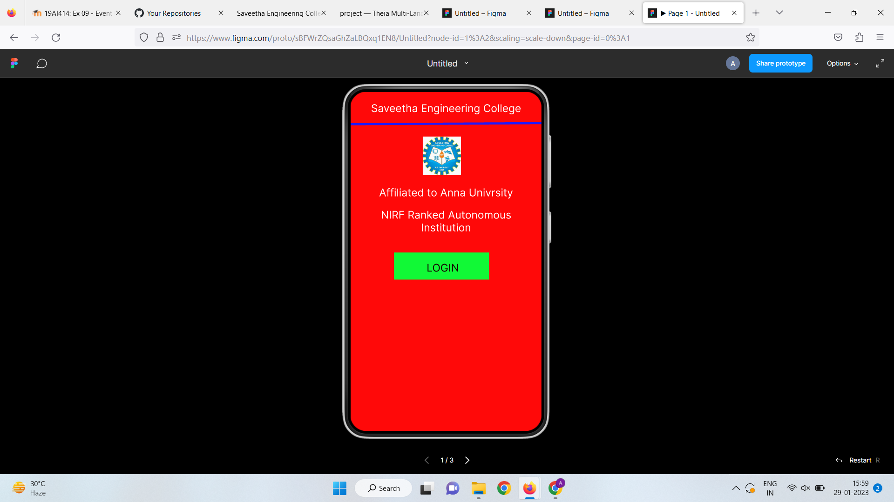
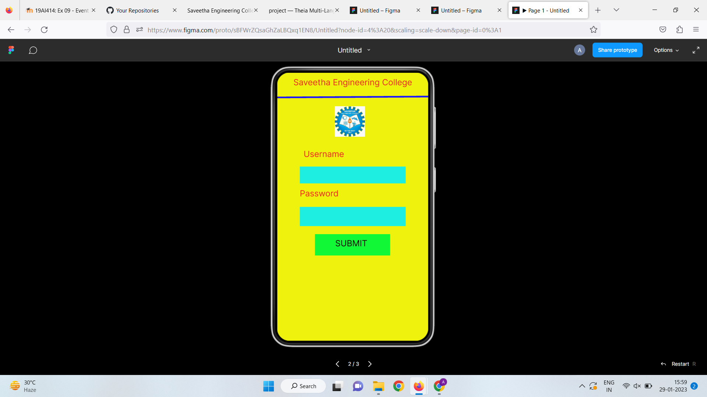
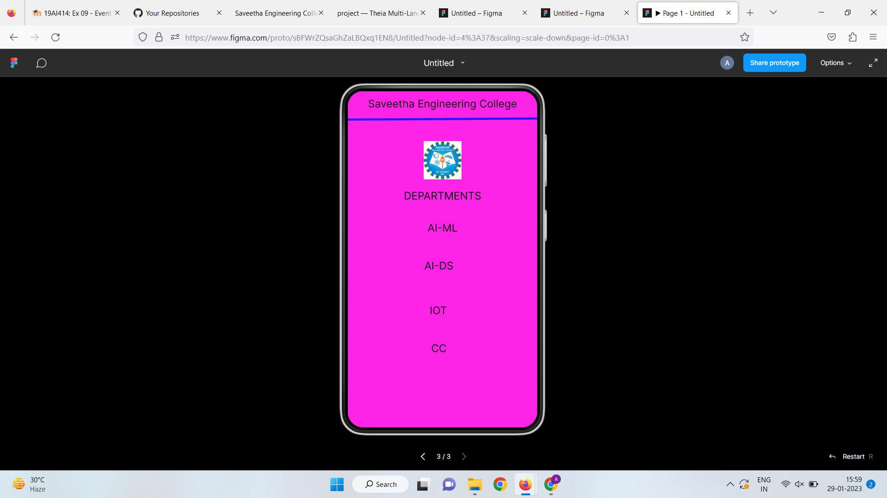

# Event Registration Web Application

## AIM:
To design, develop and deploy a web application for event registration.

## DESIGN STEPS:

### Step 1:
Create a new frame.

### Step 2:
Select any one preset size of your choice.

### Step 3:
Select the shapes you need.

### Step 4:
Import images as needed.

### Step 5:
Create pages based on your need and link them.

### Step 6:

Validate the HTML and CSS code.

### Step 6:

Publish the website in the given URL.

## DESIGN TOOL:
Figma
## code:
```

/* Home Page */
position: relative;
width: 360px;
height: 640px;
background: #FF0909;

/* Login Page */
position: relative;
width: 360px;
height: 640px;
background: #EEF20D;

/* SEC Page */
position: relative;
width: 360px;
height: 640px;
background: #FD24E7;

/* Saveetha Engineering College */
position: absolute;
width: 324px;
height: 42px;
left: 18px;
top: 12px;
font-family: 'Inter';
font-style: normal;
font-weight: 400;
font-size: 20px;
line-height: 24px;
text-align: center;
color: #131212;

/* DEPARTMENTS */
position: absolute;
width: 324px;
height: 42px;
left: 18px;
top: 187px;
font-family: 'Inter';
font-style: normal;
font-weight: 400;
font-size: 20px;
line-height: 24px;
text-align: center;
color: #131212;

/* AI-ML */
position: absolute;
width: 324px;
height: 42px;
left: 18px;
top: 248px;
font-family: 'Inter';
font-style: normal;
font-weight: 400;
font-size: 20px;
line-height: 24px;
text-align: center;
color: #131212;

/* AI-DS */
position: absolute;
width: 324px;
height: 42px;
left: 11px;
top: 320px;
font-family: 'Inter';
font-style: normal;
font-weight: 400;
font-size: 20px;
line-height: 24px;
text-align: center;
color: #131212;

/* IOT */
position: absolute;
width: 324px;
height: 42px;
left: 10px;
top: 405px;
font-family: 'Inter';
font-style: normal;
font-weight: 400;
font-size: 20px;
line-height: 24px;
text-align: center;
color: #131212;

/* CC */
position: absolute;
width: 324px;
height: 42px;
left: 11px;
top: 477px;
font-family: 'Inter';
font-style: normal;
font-weight: 400;
font-size: 20px;
line-height: 24px;
text-align: center;
color: #131212;

/* Line 3 */
position: absolute;
width: 360.01px;
height: 0px;
left: 0px;
top: 56.04px;
border: 4px solid #1E19FC;
transform: rotate(-0.32deg);

/* clglogo 4 */
position: absolute;
width: 72px;
height: 73px;
left: 144px;
top: 95px;
background: url(clglogo.jpg);
```
## OUTPUT:




## RESULT:
The program to design, develop and deploy a web application for event registration is completed successfully.